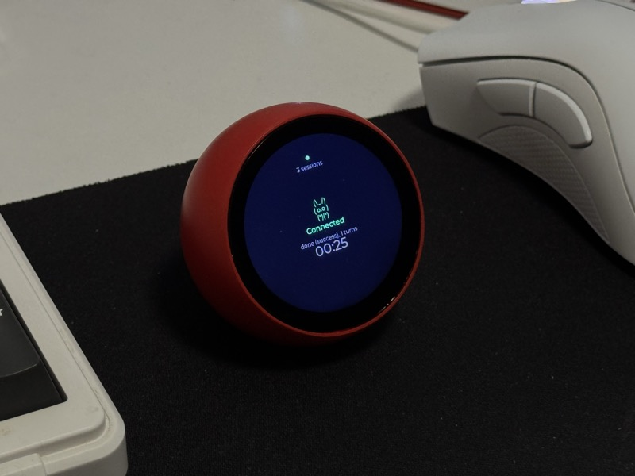

# claude-desktop-buddy-esp32

ESP32 companion device for Claude Desktop over BLE. Approve permissions, view session status, and interact with a desk pet from hardware. ESP-IDF based, with [xiaozhi-esp32](https://github.com/78/xiaozhi-esp32) hardware ecosystem compatibility.

<p align="center">
  
</p>

## Features

- **Live session status** — see how many Claude Cowork/Code sessions are running, waiting, or completed
- **Permission approval** — approve or deny tool calls right from the device button
- **17 ASCII desk pets** — cat, duck, penguin, ghost, robot, octopus, blob, capybara, dragon, goose, owl, rabbit, turtle, snail, mushroom, cactus, chonk
- **GIF character support** — push custom GIF characters from Claude Desktop
- **Clock mode** — displays time when connected and idle
- **LED feedback** — blinks on approval requests, flashes on approve/deny
- **Persistent stats** — approvals, denials, token usage, pet selection survive reboot
- **BLE secure pairing** — LE Secure Connections with 6-digit passkey display

## Supported Hardware

| Board | Chip | Display | Status |
|-------|------|---------|--------|
| **Movecall CuiCan 璀璨·AI吊坠** | ESP32-S3 | GC9A01 240×240 round | ✅ Verified |
| **Movecall Moji** | ESP32-S3 | GC9A01 240×240 round | ✅ Verified |
| **Movecall Moji2** | ESP32-C5 | ST77916 360×360 QSPI round | ✅ Verified |

More [xiaozhi-esp32](https://github.com/78/xiaozhi-esp32) compatible boards can be added — the board abstraction layer supports 70+ hardware variants.

## Quick Start

### Prerequisites

- [ESP-IDF](https://docs.espressif.com/projects/esp-idf/en/stable/esp32s3/get-started/) v5.5.2+
- Claude Desktop (Pro or higher, with Cowork enabled)

### Build & Flash

**CuiCan / Moji (ESP32-S3):**

```bash
idf.py set-target esp32s3
idf.py build
idf.py -p PORT flash
```

Edit `sdkconfig.defaults` to select your board:
- `CONFIG_BOARD_TYPE_MOVECALL_CUICAN_ESP32S3=y` (default)
- `CONFIG_BOARD_TYPE_MOVECALL_MOJI_ESP32S3=y`

For Moji boards, also enable USB console: `CONFIG_ESP_CONSOLE_USB_SERIAL_JTAG=y`

**Moji2 (ESP32-C5):**

```bash
idf.py -B build_c5 set-target esp32c5
idf.py -B build_c5 build
# Enter boot mode: unplug USB → hold BOOT → plug USB → release BOOT
python -m esptool --chip esp32c5 -p PORT --no-stub write_flash @build_c5/flash_args
# Unplug and replug USB normally to start
```

### Pairing with Claude Desktop

1. Enable Developer Mode: **Help → Troubleshooting → Enable Developer Mode**
2. Open **Developer → Open Hardware Buddy…**
3. Click **Connect** and select your device (advertises as `Claude-XXYY`)
4. Enter the 6-digit passkey shown on the device screen
5. Start a **Cowork** session — the device will show live session status

## Controls

| Action | No approval pending | Approval pending |
|--------|-------------------|-----------------|
| **Click** | Switch display mode (pet ↔ info) | Approve |
| **Long press** | — | Deny |
| **Double click** | Switch pet species | Switch pet species |

## Architecture

```
main/
├── boards/                       # Hardware abstraction (from xiaozhi-esp32)
│   ├── common/                   # Board, Button, Backlight, LED
│   ├── movecall-cuican-esp32s3/  # CuiCan (GC9A01)
│   ├── movecall-moji-esp32s3/    # Moji (GC9A01)
│   └── movecall-moji2-esp32c5/   # Moji2 (ST77916 QSPI)
├── display/                      # LVGL display layer
├── buddy/
│   ├── ble/                      # Nordic UART Service (Bluedroid)
│   ├── core/                     # BuddyApp, TamaState, PersonaState, protocol
│   ├── storage/                  # NVS persistence
│   ├── ui/                       # LVGL UI (round display optimized)
│   ├── pet/                      # 17 ASCII species + GIF character
│   └── xfer/                     # BLE file transfer (LittleFS)
└── main.cc
```

## BLE Protocol

Implements the [Claude Desktop Hardware Buddy protocol](https://github.com/anthropics/claude-desktop-buddy/blob/main/REFERENCE.md):

- Nordic UART Service (NUS) over BLE
- JSON messages, newline-terminated
- Heartbeat snapshots (sessions, tokens, entries)
- Permission prompt forwarding and response
- GIF character folder push transfer
- LE Secure Connections with MITM protection

## Adding a New Board

1. Create `main/boards/<board-name>/config.h` with pin definitions
2. Create `main/boards/<board-name>/<board>.cc` extending `Board`
3. Add the board to `main/Kconfig.projbuild` and `main/CMakeLists.txt`
4. See existing boards for reference

## License

[MIT](LICENSE)

## Acknowledgments

- [xiaozhi-esp32](https://github.com/78/xiaozhi-esp32) — board abstraction and hardware ecosystem
- [claude-desktop-buddy](https://github.com/anthropics/claude-desktop-buddy) — BLE protocol specification and desk pet design
- [Anthropic](https://www.anthropic.com) — Claude Desktop Hardware Buddy API
